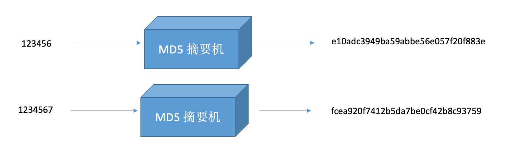

# MD(message-digest)： 信息摘要算法原理

家族:MD2、MD3、MD4、MD5(目前最常用的算法)

MD5最重要的一个特点: 加密不可逆、(不变形、散列形)

## 密码学常见的几个概念:

加密、解密、签名、验签、摘要、编码、公钥、私钥

### 编码

可以参考ASCII、Base64这种编码，我们可以针对源数据进行编码，不会损坏源数据，并且我们可以通过编码方式对源数据进行解码！

### 摘要

对信息计算摘要值，有信息损耗，如md-5、sha-0..等

